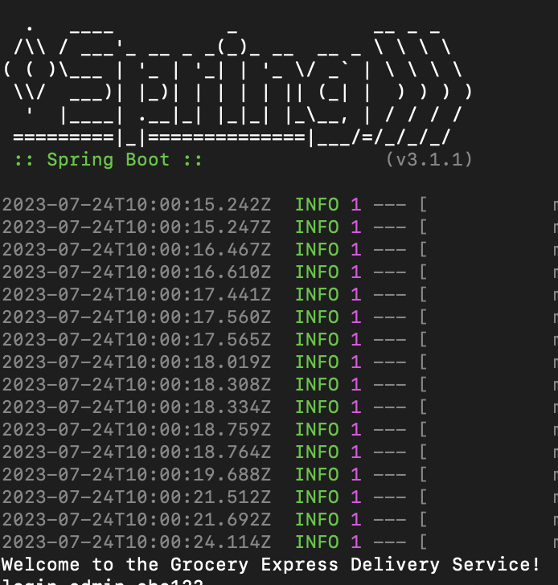

# Drone delivery system -- group 35

Please run the following commands at the root folder `droneDeliverySystem`

Spin up the mysql db at the background

```
docker-compose up -d db
```

Run our app interactively

```
docker-compose run dronedeliverysystem
```

Please note that the dronedeliverysystem application is currently not compatible with ARM64 architecture. The primary reason for this limitation is that the Docker image openjdk:17-jdk-alpine lacks a specific version built for ARM64. Please change to openjdk:17-ea-16-jdk.

If you successfully spin up the app, you should be able to see the welcome note


We created the roles for you to test the app already. Please use the info to log-in.

| Role         | account | password |
| ------------ | ------- | -------- |
| Customer     | aapple2 | default  |
| StoreManager | cat     | default  |
| admin        | admin   | abc123   |

### New commands

| Command                   | Argument                                                      |
| ------------------------- | ------------------------------------------------------------- |
| login                     | account, password                                             |
| logout                    |                                                               |
| adjust_frequency          | limitCount, limitPeriod                                       |
| adjust_ReturningTimeFrame | timeframe                                                     |
| request_return            | storeName, returningOrderID, purchaseOrderID, customerAccount |
| display_purchased_orders  | storeName                                                     |
| return_item               | storeName, purchasedOrderID, returnOrderID, itemName          |
| placed_return             | storeName, returnOrderID, purchasedOrderID                    |
| display_returning_orders  | storeName                                                     |
